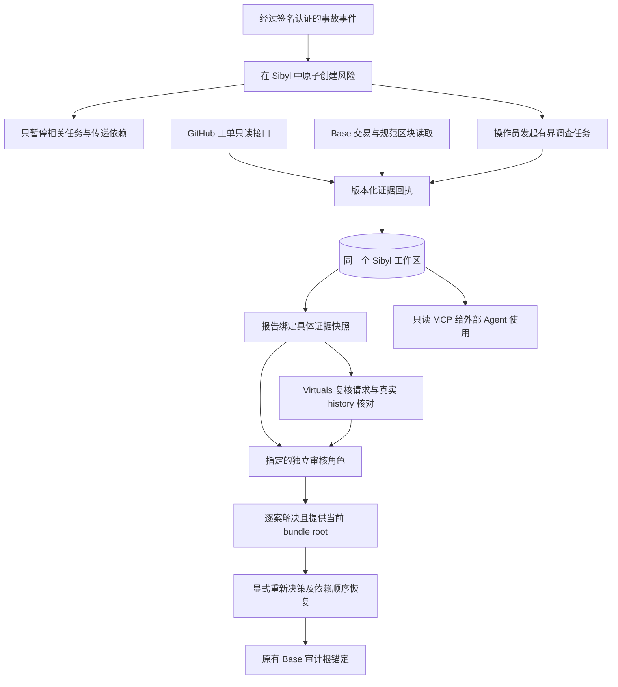

# MemoryGuard 2.2：争冠方向的代码施工与落地说明

基线：`23f35b4751114a71f680c545a4242686e0cd11c1`，2026-09-05。
交付：源码增量，不是线上部署结果、获奖承诺或独立安全审计。

## 1. 本次到底解决什么

2.1 已经有精确风险传播、独立交接、逐案解决、显式重新决策和版本绑定证据。继续只加状态枚举意义不大。
本轮把“操作者填一个摘要”推进为“连接真实接口获取有出处的材料，跨会话重用材料，检查材料失效，再用材料支持独立调查”。

定位保持一致：MemoryGuard 不替 Agent 自动付钱，而是让 Agent 的调查和恢复必须经过记忆中的风险、证据与审核条件。

新增闭环：



**不建立第二个生产业务数据库。**新对象写入已有 `Workspace.artifacts`，由 `SibylWorkspaceStore` 和原有聚合事务/文件锁提交。
没有启用 connectors 配置时，原有手动作用范围继续运行；不会自动把历史演示数据升级为经过真实接口验证的证据。

## 2. 已落地能力与真实完成边界

| 能力 | 本包实现 | 不应宣称 |
|---|---|---|
| GitHub 工单 | 固定 GitHub API、仓库白名单、对象身份与时间校验、正文哈希隔离 | 已读取你的真实工单，或 issue closed 等于业务风险解除 |
| Base 证据源 | 链、交易、receipt、目标、区块哈希、确认数验证 | 已执行链上交易、绝对最终性、已取得伙伴倍率 |
| 签名事故入口 | HMAC、时间窗口、持久幂等、只开风险 | 事件内容客观真实、完整企业身份系统 |
| 多来源策略 | 必需来源、配置声明的独立组、TTL、单案请求预算 | 两个分组就是两个独立真人或权威来源 |
| 调查任务 | 先保存计划，再采集、生成报告、交接；不自动接受/解决 | 无人监督的自主调查或 exactly-once 外部请求 |
| ACP | 正式 CLI v2 history 读取、请求与提供方消息绑定、历史状态保存 | 自动创建/支付 job、成本上限由服务端强制执行、已取得倍率 |
| MCP | stdio initialize/ping/tools 子集、7 个只读工具 | 完整 MCP 全协议认证、所有客户端兼容性已验收 |
| 历史快照导出 | 报告使用过的具体 bundle、哈希离线核对 | 哈希就是第三方签名或真实世界事实证明 |
| 实验 | 官方 SDK 默认的脚本与可见的模拟 HTTP 对照 | 本次已运行、真实费用收益、PMF |

## 3. 文件与接口地图

### 来源配置

- `src/proofops_casework/source_models.py`：服务端配置及请求模型。
- `config/casework-connectors.example.json`：仅 GitHub 的最小示例。
- `config/casework-connectors.full.example.json`：GitHub + Base + HMAC + ACP 的完整模板。
- `casework.connectors.env.example`：非秘密环境变量说明。

配置只能由操作员管理。请求不能提交任意 URL、角色、RPC 地址、token_env 或 authority。
配置中的示例地址不是已部署地址，也不是测试交易。必须替换为你的实际测试对象。

### 来源读取

- `connectors/http_client.py`：禁止自动重定向、禁止继承代理环境、响应体上限、超时、脱敏异常。
- `connectors/github_issue.py`：只接受 `owner/repository#number`。
- `connectors/base_transaction.py`：只接受交易哈希，并要求链与 case scope 一致，交易目标等于 case target。

GitHub REST 使用本次官方文档示例版本 `2026-03-10`。PR 会被识别并拒绝，不能混作 issue。
GitHub title/body 不保存为原文，只保存域隔离哈希；模型不收到这些原文。
Base 查询仅使用固定 JSON-RPC 方法，不提供任意 RPC 透传。合约创建交易的 `to=null` 不符合本采集器的目标匹配语义。

### 持久化与状态机

- `source_state.py`：当前证据 head、receipt 有效性、证据版本依据。
- `source_service.py`：采集、缓存、来源策略、调查任务、报告来源导出。

新 artifact 类型：

```text
SOURCE_REQUEST            网络读取前先提交；PENDING / OBSERVED / FAILED / STALE
SOURCE_HEAD               每个 case + source 的当前候选
SOURCE_RECEIPT            实际观察到的规范化材料及哈希、时效
EVIDENCE_MISSION          输入列表/审核对象/来源配置的固定任务计划
REPORT_EVIDENCE_BUNDLE    报告实际使用的来源快照
CASE_RESOLUTION_PROOF     解决风险时使用的报告根、bundle root、审核者
INCIDENT_RECEIPT          已认证事件的来源与幂等摘要
ACP_REVIEW_PLAN           需要操作员外部行动的请求合同
```

网络请求在锁外运行；开始前的 reservation 必须先成功持久化。
如果进程在请求途中退出，重放同一个键会显示持久化的 PENDING，而不会盲目再发一次。
操作员检查后可以用新键重采；这不是后台队列，也不自动判断远端是否执行过。

失败的 force refresh 会使旧成功证据退出当前依据，不能静默使用 last-good 放行。
每个来源每个 case 的默认 20 次预算计入失败尝试；它是请求次数预算，不是美元支付预算。
来源 API 返回失败或网络超时时无法精确获知远端实际处理次数，输出保留未知，不伪造为零。

### 对既有内核的修改

`core.py`：
- `investigation_basis` 在有外部来源时纳入其当前 head。
- `task_basis` 在有新来源解决记录时纳入 `CASE_RESOLUTION_PROOF`。
- 没有新 artifact 的历史手动决定仍用原有结构，避免无意义重写所有旧哈希。

`service.py`：
- 可选绑定 `EvidenceDesk`。
- 调查前检查配置要求的来源是否齐全、未过期。
- 模型只接收风险类型、计数、摘要以及固定信号代码；自由文本继续隔离。
- 工具 trace 加入 `evidence.inspect`，输出哈希绑定完整规范化证据上下文。
- 同一提交保存报告以及当时使用的 bundle，不靠后来的“当前 head”解释历史。
- 交接/接受/解决继续通过 `_valid_report` 检查，来源过期或变化会使旧报告失效。
- source-gated 作用范围解决风险时必须提交当前 bundle root。
- 新解决记录把报告和 bundle 绑定进后续任务证明，但仍不产生付款权限。

`runtime.py`：
- 注册独立来源路由，启用后 `/api/runtime` 报告 `casework-v2.2`。
- 启动读取配置但不进行外部网络调用。
- 未配置来源不退回其他数据库。
- 配置失败会阻止启用，而不是自动忽略安全策略。

## 4. 精确 HTTP 接口

所有业务接口使用服务器发放的 Bearer 凭证；HMAC 入口例外，使用独立签名。
所有写请求继承 `Command`：`idempotency_key / session_id / expected_revision`。

| 方法与路径 | 权限 | 行为 |
|---|---|---|
| GET `/api/v2/integrations` | 所有合法只读角色 | 脱敏来源目录 |
| POST `/api/v2/cases/{id}/sources` | owner / investigator | 一次有持久记录的采集 |
| GET `/api/v2/cases/{id}/dossier` | scoped reader | 当前证据、时效、bundle root |
| POST `/api/v2/cases/{id}/mission` | investigator | 有界多来源采集、调查、可选交接 |
| GET `/api/v2/reports/{id}/sources` | scoped reader | 报告当时的具体来源快照 |
| GET `/api/v2/tasks/{id}/impact` | scoped reader | 全祖先依赖图与当前有效性 |
| POST `/api/v2/cases/{id}/partner-review` | investigator | 固定报告的 ACP 请求计划 |
| GET `/api/v2/partner-reviews/{id}` | scoped reader | 已保存请求与观察记录 |
| POST `/api/v2/partner-reviews/{id}/verify` | investigator / reviewer | 真实 ACP history 查询与绑定 |
| POST `/api/v2/integrations/incidents/{source}` | HMAC | 原子创建具体风险 |
| GET `/api/v2/public-source-experiment` | public | 独立导出的合成实验摘要，不读取 DB |

### 单来源采集示例

```json
{
  "idempotency_key": "request_github_001",
  "session_id": "session_investigator_001",
  "expected_revision": 6,
  "source_id": "github_incidents",
  "resource": "seekitx/proofops-memoryguard#1",
  "force_refresh": false
}
```

必须使用实际存在且与你的测试事件相关的 issue，不能直接把模板 `#1` 当已验证材料。
返回 CLOSED 也不解除风险，审核员还要检查它与 case 的业务关联是否成立。

### 多来源任务示例

```json
{
  "idempotency_key": "mission_review_001",
  "session_id": "session_investigator_001",
  "expected_revision": 8,
  "queries": [
    {"source_id":"github_incidents","resource":"seekitx/proofops-memoryguard#1"},
    {"source_id":"base_receipts","resource":"替换为实际的0x交易哈希"}
  ],
  "reviewer_id":"actor_reviewer"
}
```

上面的第二个 resource 是说明性占位，不能提交为真实请求。
每次最多 4 个不同来源；参数改变必须换任务键，不能把同一个 mission 悄悄改给另一审核员。
任务会返回实际阶段：`COLLECTION_INCOMPLETE / SOURCES_STALE / REPORT_STALE / INVESTIGATED / HANDED_OFF`。
不会自动调用 `accept_handoff`、`resolve`、`reconsider` 或钱包。

## 5. 真实签名事件接入

请求头：

```text
X-MemoryGuard-Timestamp: Unix epoch seconds
X-MemoryGuard-Delivery: 唯一投递编号
X-MemoryGuard-Signature: sha256=<64位小写十六进制>
```

签名输入为原始字节：

```text
timestamp + "." + delivery_id + "." + raw_body
```

算法 `HMAC-SHA256`，密钥从配置指定的环境变量读取。
正文只能是 `{ "kind": "dispute|revocation", "evidence_digest": "64位哈希" }`。
原始事件生产者自行生成摘要；MemoryGuard 不假装验证摘要对应的外部事实。

接收者由服务端配置固定 actor 与 scope，调用方不能换 tenant/target。
同一 delivery、同一内容只创建一次；同一 delivery 换内容会冲突。
过期投递会被拒绝，即使签名有效。超过时效后的灾难恢复/重投应由操作员明确处理，不能取消窗口。
同一事件验证、case 写入和影响传播在同一个 Sibyl 聚合提交中完成。

## 6. 伙伴与工具接入

Virtuals 与 MCP 的详细配置见 [CASEWORK_22_INTEGRATIONS.md](CASEWORK_22_INTEGRATIONS.md)。
本包没有给服务器增加私钥、交易签名器、`fund`、`complete` 或 `create-job` 执行能力。

ACP 的软件接入并非仅挂 Logo：它从真实 CLI 查询历史，要求客户最初的 requirement 精确匹配本地请求，要求复核消息来自配置的 provider，而且终态与事件历史一致。
但 CLI 输出依然不是独立链上审计；服务端不会因为一个 `completed` 字符串就宣布获得比赛倍率。

MCP 的 7 个工具都只读，可用于把你的风险状态、恢复顺序和来源快照供其他 Agent 使用。
它不允许任意 URL，不会把客户端传入的工具名映射为 Python 函数执行。

## 7. 本次实验设计

已有 24 个独立业务场景继续保留，不把它们偷换成 24 个独立客户或真实交易。
新增 `scripts/casework_source_benchmark.py`：两组使用相同 API 模拟响应、相同解析器、相同服务和存储。

- 组一：在 TTL 内使用持久缓存。
- 组二：相同逻辑请求每次明确 force refresh。
- 报告两组实际记录的读取次数、状态轨迹，以及新服务句柄、过期、失败后的行为检查。

默认采用官方 Sibyl，但外部 HTTP 明确是 `SYNTHETIC_HTTP_TRANSPORT`。
这能检验缓存状态机与持久化，不能证明真实数据足够新，也不能证明节省了多少美元。
对相同输入连续读取，缓存有优势是预期结果；需要增加来源变更频率/TTL 对照和真实独立评测后才能泛化。
没有给未执行的实验预填结果。

```bash
python scripts/casework_source_benchmark.py --backend sibyl --reads 8 --out /tmp/source-experiment.json
# 仅用于工程调试；永远保留 TEST_DOUBLE 标签：
python scripts/casework_source_benchmark.py --backend test --out /tmp/source-experiment-test.json
```

`casework_verify_report.py` 可以核对导出报告的内部哈希：

```bash
python scripts/casework_verify_report.py /path/to/explicit-report-export.json
```

通过只说明输入内部一致。它不能验证是否真的访问了 GitHub，也不能认证生成者身份或当前时效。

## 8. 安装与启用顺序

1. 把 ZIP 解压到项目目录之外，先运行安装器只读预检。
2. 在基线 commit 上应用补丁；新文件冲突或 tracked changes 会停止。
3. 审查 diff，提交新 commit。先不要上传真实凭证、工作数据库或用户资料。
4. 保留你现有的 `SIBYL_MEMORY_PATH` 与角色 registry；已有凭证不要重新生成覆盖。
5. 把配置复制到 `.casework-private/connectors.json`，修改租户/subject/实际目标/仓库等。
6. 用本地配置预检检查格式与凭证引用，不会发网络请求。
7. 在隔离测试部署跑完整测试、SDK、浏览器和真实来源读。
8. 完成后再在正式参赛部署启用，使用同一最终 SHA 录制。

```bash
chmod 600 .casework-private/connectors.json
python scripts/casework_connector_preflight.py \
  --config .casework-private/connectors.json \
  --registry .casework-private/registry.json
```

环境变量：

```text
CASEWORK_ENABLED=1
CASEWORK_AUTH_FILE=/absolute/path/.casework-private/registry.json
CASEWORK_CONNECTORS_FILE=/absolute/path/.casework-private/connectors.json
BUILD_COMMIT=<真实完整提交SHA；Render也支持现有RENDER_GIT_COMMIT回退>
```

完整示例启用了 HMAC 和 ACP，含故意不可用的路径/零哈希占位；没有准备好就使用最小示例，不要照抄为生产配置。
`/casework/sources` 是操作界面，`/casework/evidence` 是公开证据界面；公开界面没有操作凭证。

## 9. 安全与迁移影响

- 源码会保留 v1 与 v2.1 历史，不删除数据库和视频。
- 有来源约束的旧报告，需要重新采集和调查；不能把原手动报告变成来源验证报告。
- 新来源记录只在 `artifacts` 中增加，Workspace 外层仍是 `memoryguard-casework/2`。
- 新解决证明会改变相关任务的 basis，旧 READY 需要重评；无关任务不因来源读取全局 revision 增加就失效。
- 同一任务的旧报告、旧来源、旧 ACP 观察保留历史含义，不升级为当前。
- 禁止通过把 source policy 移除、切回匿名 v1、修改标签来绕过实际缺失的证据。
- 底层限制仍是单 POSIX 主机、本地磁盘、250 个任务、500 个 case、5,000 次变更、8MB 聚合。
- 来源快照和重试记录占空间；这是黑客松受限工作区，不是无限吞吐多机生产平台。
- 证据读取是同步有界调用。长 mission 遇代理超时需要查询已保存状态并用相同键重试；没有后台自动恢复承诺。
- 读取上限和 TTL 是安全/成本取舍；更久缓存减少读取但增加过期风险，不能用缓存命中率替代安全指标。

## 10. 验收门槛

以下是施工后需要执行的清单，不是本次已通过的结果：

```bash
python -m pytest tests -q
python scripts/casework_champion_probe.py --out /tmp/core-capture.json
python scripts/casework_source_benchmark.py --backend sibyl --out /tmp/source-experiment.json
node --check apps/web/assets/casework-sources.js
node --check apps/web/assets/casework-evidence.js
```

必须另外验证：
- 实际 GitHub issue 能读，未允许仓库不能读，PR 不能混入。
- 实际 Base receipt 匹配目标、区块、确认数；未入块不能变成功。
- 同一来源重试不盲目再次获取；过期/失败 force refresh 使旧报告不可用。
- HMAC 重复事件只出现一个 case；错误签名和客户端伪造 scope 不落库。
- 审核员解决时需要当前 bundle root；单个 case 解除不能清掉其他风险。
- 真实模型报告有当前 context 绑定回执；模型失败仍无自动解除风险。
- ACP 的实际 provider/requirement/review message 匹配，不把他人的 completed job 挂进本项目。
- 桌面、移动浏览器切换角色不残留旧资料；MCP 实际客户端只获得允许的只读工具。
- 最终 Base 合约单独编译、测试、部署、交互、复核；本次未修改合约来伪造完成。

## 11. 争冠的产品展示重点

主故事不变：**相关任务被暂停，无关任务继续；调查拿到来源，独立审核逐案处理，只有正确的工作恢复。**
新增差异是来源与成本：第二个进程可以使用同一份未过期来源证据，不会重复请求；证据变更后旧报告必须作废。

不要讲“接入了很多 SDK”，要现场展示：

1. 一个真实且可公开查看的测试 issue / 测试链交易。
2. 采集回执和报告之间的绑定。
3. 切换进程后持久记忆的作用。
4. 故意让证据过期或风险重开，旧报告被拒绝。
5. 新报告、独立交接、逐项解决、显式恢复。
6. 已真正完成时再展示 Base 审计交易和 ACP 任务。

官方评分要求以实际执行为准。代码量、分组数、MCP 工具数、作者自己实验成功，均不直接等于分数、PMF 或夺冠概率。
这份增量是争冠的可实施功能基础，不是比赛结果保证。
