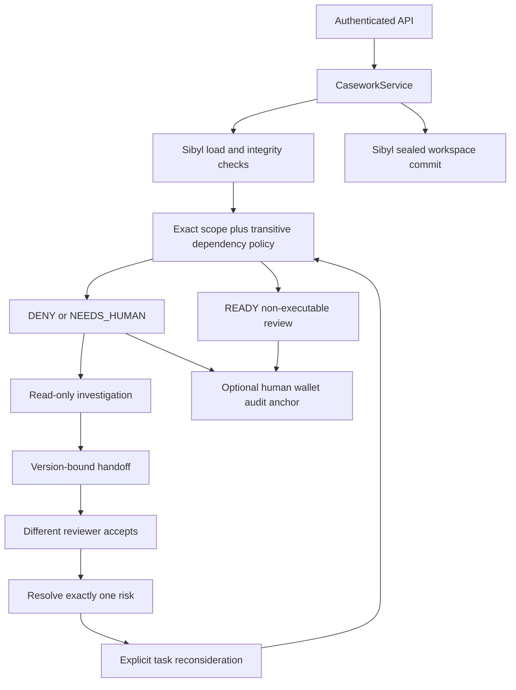

# Casework v2 — implementation and memory critical path

## Product

A scoped risk is remembered, related tasks are suspended, an investigator hands off a version-bound report, a distinct reviewer resolves individual risks, and tasks must be explicitly reconsidered. Unrelated tasks remain usable. Every result is non-executable: this module neither pays nor grants a payment capability.

## Interface and files

`src/proofops_casework/service.py::CaseworkService` owns all use cases. `core.py` owns pure deterministic policy, dependency closure and hash validation. `models.py` owns strict schemas. `api.py` is a thin authenticated HTTP mapping. `store.py` is the only runtime persistence adapter.

### Where Sibyl is load-bearing

- `SibylWorkspaceStore.load(tenant_id)` calls official `MemoryClient.get_entity` for the v2 tenant workspace.
- `SibylWorkspaceStore.save(tenant_id, workspace)` calls official `set_entity` with the complete sealed WARM aggregate.
- Every command/read reopens this authority state under a bounded tenant lock; there is no business-state cache or secondary database.
- An absent SDK, inaccessible store, corrupt hash or missing initialized workspace stops the path. A missing workspace is NOT auto-created by evaluate.
- Only an explicit authorized bootstrap creates a fresh empty workspace. No valid baseline is fabricated during bootstrap.

This version uses one WARM workspace entity per tenant. Case histories, handoffs, reports and audit history are nested in that entity. This is dynamic state, **not a claim that all five Sibyl tiers, vector search, consolidation or SDK temporal recall were implemented**. Lockfiles are concurrency coordination, not memory fallback.

## Key semantics

- Scope is `(subject_id, chain_id, normalized target, method)`. Tenant comes from server credentials.
- Task dependencies form a DAG with full transitive traversal; no fixed hop limit. Existing-parent-only creation and same-subject edges constrain the graph.
- A new risk/reopened case or baseline change marks matching tasks and downstream dependents `SUSPENDED` with taints.
- Any OPEN case in a task's scope/dependency closure makes the result DENY.
- All scopes in the closure need the **current** baseline, valid expiry and integer-cent amount within limit. Missing/expired/overlimit → NEEDS_HUMAN.
- Dependencies require a current unexpired READY decision with matching basis. Resolution does not automatically refresh downstream decisions.
- After risk resolution, ordinary evaluate does not clear taints. A reviewer must call reconsider; a successful new READY decision clears taints.
- Past decision objects retain their roots. `current_decision_id` changes. Preparing a review reloads policy/basis/expiry, including on idempotent retry.
- Irrelevant scope changes do not invalidate a task's basis merely because the global workspace revision increased.

## Investigation and handoff

Mandatory actual read tools: `case.inspect`, `dependencies.trace`. Optional: `precedent.lookup` over same scoped resolved cases. The existing remote model adapter may choose the optional tool; it cannot choose resolution or payment. No raw note or generated prose becomes policy. Model receipt and deterministic tool outputs are bound into the report root.

External planning runs outside the write lock. Before persisting its report, the relevant case/task basis is reloaded and checked. A changed case version or relevant memory rejects stale work. Handoff points to a report; assigned reviewer must differ from investigator, accept it, and hold subject scope. Resolution checks these facts again.

Roles are security principals, not proof of distinct human beings. Default synthetic demonstration credentials must not be described as three real users or three autonomous models. The model assists investigation; dispatch of business commands is explicitly operator-controlled.

## API

See generated OpenAPI for full strict bodies. All commands contain `session_id`, `idempotency_key`, `expected_revision`; identity, timestamps and verdict come from the server.

| Endpoint | Role | Purpose |
|---|---|---|
| `GET /api/v2/casework` | all scoped roles | Filtered live workbench state |
| `POST /api/v2/bootstrap` | owner | Explicit empty tenant initialization |
| `POST /api/v2/baselines` | owner | Replace scoped current baseline, retain history |
| `POST /api/v2/tasks` | owner/investigator | Register task and initial non-executable decision |
| `POST /api/v2/cases` | owner/investigator | Record scoped risk |
| `POST /api/v2/cases/{id}/investigate` | investigator | Persist bounded report |
| `POST /api/v2/cases/{id}/handoff` | investigator | Assign independent reviewer |
| `POST /api/v2/handoffs/{id}/accept` | assigned reviewer | Acknowledge current report |
| `POST /api/v2/cases/{id}/resolve` | assigned reviewer | Resolve one current risk |
| `POST /api/v2/cases/{id}/reopen` | owner/investigator | Increment case version, re-suspend |
| `POST /api/v2/tasks/{id}/reconsider` | reviewer | New decision after fresh checks |
| `POST /api/v2/tasks/{id}/prepare-review` | owner/investigator/reviewer | Create non-executable artifact from current READY |
| `GET /api/v2/tasks/{id}/replay` | scoped readers | Immutable prior decisions + current validity |
| `POST /api/v2/tasks/{id}/anchors` | reviewer | Persist fixed digest-only audit plan |
| `POST /api/v2/anchors/{id}/verify` | reviewer | Independently verify supplied tx hash |

## v1 integration and compatibility

Four existing files are modified by the installer; v1 kernel/serialization/contract are untouched. With CASEWORK_ENABLED=1, v1 anonymous mutation endpoints return410; v1 GET historical evidence remains. V2 lives in a different SDK entity category and does not migrate/import old demo facts. Disable the flag to revert to the old demo, but do not advertise both as a unified production permission system.

## Deliberate limits

Single host, POSIX locks, local persistent disk; max250 tasks/500 cases/5000 commands and8MB aggregate. No NFS/shared-host guarantee, sharding, outbox to external payment provider, exactly-once economic execution, automatic event-feed ingestion, arbitrary task mutation or vector search. Add these only when the product and measurements justify them.

`Decision.tool` names the permitted next route; that field alone is not a tool-execution receipt. `prepare-review` creates a persisted non-executable artifact; investigation trace entries correspond to actual deterministic read calls. Do not describe a changed label as a completed external action.

When enabled, `/` redirects to `/casework`, so the obsolete v1 form does not invite calls to disabled writes. Existing `/evidence` is historical v1 and receives an explicit evidence-scope header; prepare a separate final v2 evidence index only after the new real gates pass. For judging, provide a least-privilege viewer credential through an approved private channel or publish a separately reviewed redacted evidence artifact. Never expose owner/reviewer credentials as a public demo shortcut.
