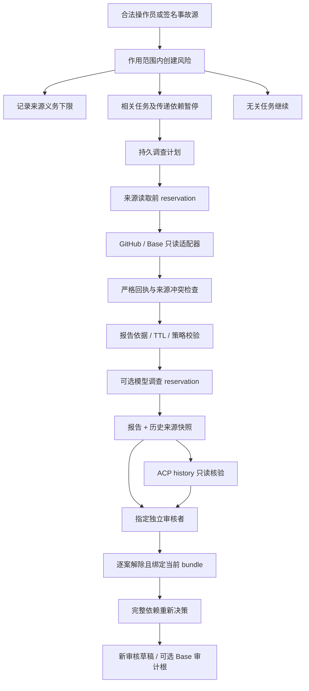
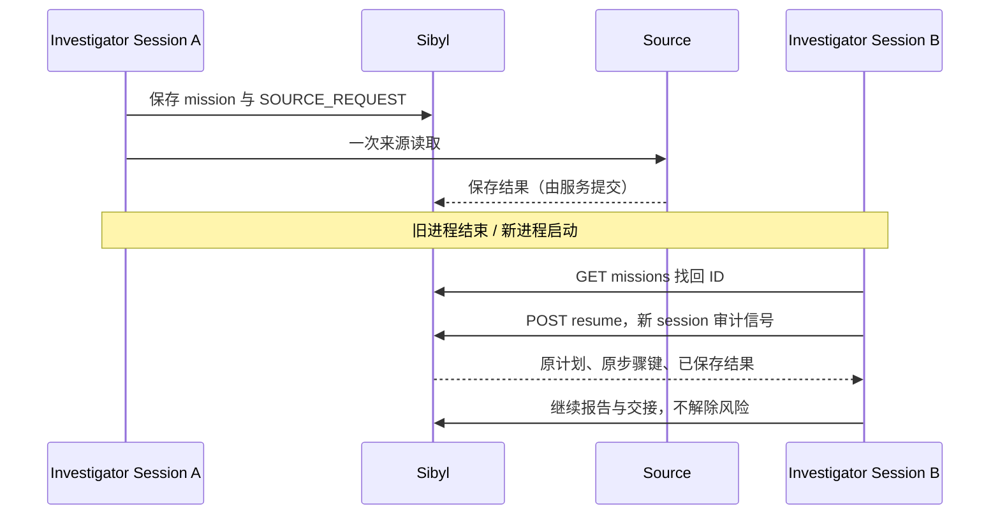

# MemoryGuard · Sibyl 最终候选版施工与发布蓝图

版本：`2.3.0-rc1`。日期：2026-09-05。赛道：**Sibyl Memory Hackathon**。

审查基线：`b9f701509c7c9fa75b87515694b2cc8d0e8f3dd2`。

本文件中的「已实现」指源码已经写入交付包；不等于部署、通过测试、真实接入或获奖。
本次没有运行产品测试、编译、模型调用、钱包操作、ACP、远端部署或私人提交。
本轮官方规则页面再次访问失败；赛事定位沿用此前已核验信息，不声称规则有新变化。

## 0. 决策摘要

你的新提交已经不是最初只演示 READY→DENY 的小内核。
它已经拥有作用范围隔离、任务依赖传播、调查与独立交接、来源采集、经验复用、恢复顺序、MCP 和 ACP history。
因此这轮不再迁移框架、不再扩展 BNB Marketplace，也不重复实现已有功能。

当前应该做的是把已有功能拼成一条能经受重启、并发、来源变化、角色切换和再次运行的完整产品路径。
这份候选版集中修复已定位的边界，并提供单一发布门禁。
**「一次交付统一修复包」可以做到；「保证此后永远没有问题／保证第一名」没有证据支持。**

最终产品叙事：

> Remember the risk. Investigate from sources. Resume only the right work.
>
> 记住风险；依据来源调查；只恢复应该恢复的工作。

冠军目标不等于功能数量最多。
更有说服力的展示是：相关任务停、无关任务继续；新进程继续同一调查；旧来源失效就拒绝旧报告；两个风险逐个处理；只有独立复核后产生新的可审核决定。

## 1. 审查与交付边界

### 1.1 实际读了什么

- 通过 GitHub 连接器确认 main 和当前提交。
- 读取当前 Casework 完整文件树，并按 Git blob/tree 核对本地审查副本。
- 当前 Casework 子树的 Git tree 是 `6b9b528037b5078855a1d021371415de857e86ec`。
- 特别保留本次用户新增的来源冲突检查、ACP HOME 路径保护、主程序配置及测试修正。
- 对源码、请求模型、持久化、采集、任务、报告、伙伴观察、公开证据和入口进行交叉审查。
- 没有把早期竞品文档中「没有 v2」的旧结论套用到当前提交。

### 1.2 不宣称已经做了什么

- 没有完整远端部署镜像复现。
- 没有取得新版本真实模型 generation receipt。
- 没有取得新的 Base 审计交易或 ACP job。
- 没有打开你的本地原视频、读取私人比赛提交后台或标记 ready。
- 没有独立重跑竞争对手，也不提供虚构排名和获胜百分比。
- 没有把未运行的回归测试列成通过。

### 1.3 为什么是增量包

原仓库已有数据格式和公开证据，不应清空重建。
交付包以当前 SHA 为安装前提，包含完整修改文件、逐文件哈希、补丁和备份回滚工具。
它不是完整 Git 仓库备份。不要删除原工程再用本包覆盖。

## 2. 发现、修复与验收矩阵

| ID | 当前边界 | 本包修复 | 应验证的结果 |
|---|---|---|---|
| F01 | 删除来源策略后可能退回手工报告路径 | 持久 `SOURCE_POLICY_GUARD`，来源义务只可加强 | 配置移除／削弱明确阻断 |
| F02 | 重开风险后旧来源 head 版本不匹配，可能丢失来源要求 | 从历史来源和报告继承来源义务 | 必须获得新版本来源，不是回退手工 |
| F03 | 禁用 EvidenceDesk 后不再校验旧来源报告 | `require_desk` 在调查和报告校验中执行 | `SOURCE_GUARD_UNAVAILABLE` |
| F04 | 非强制来源的报告有材料但解除摘要未严格匹配 | 只要进入来源流程就要求当前 bundle | 错 bundle 拒绝 |
| F05 | 任意适配器结果可通过字典展开覆盖回执绑定字段 | 严格适配器 envelope，服务端独占身份与时间 | 伪造 case/expiry/authority 字段拒绝 |
| F06 | 回执只检查部分 head 关系 | 加入 request、resource、组、作用范围、时效关系 | 错配和未来回执拒绝 |
| F07 | 同一调查任务跨新 session 重试会冲突 | 保存原逻辑请求，新增列表／状态／resume | 换进程后继续原计划，不重采成功来源 |
| F08 | 请求失去响应后浏览器不知道 mission ID | 从 Sibyl 列出作用范围内的 mission | 不靠 localStorage 找回 |
| F09 | 两个未完成的相同调查可能重复调用模型 | 模型前持久 reservation，完成时原子写 report | 同命令并发只允许一个新尝试 |
| F10 | ACP current 未完整包含来源 TTL、覆盖与策略校验 | 复用 `_valid_report` | 过期来源使伙伴计划非 current |
| F11 | 多份互相矛盾的有效 ACP review 取最后一份 | 明确 `ACP_PROVIDER_REVIEW_CONFLICT` | 不把最后一条当赢家 |
| F12 | JSON 重复键、NaN、溢出和深层嵌套 | 统一严格、有界 JSON 解析 | 含歧义的输入不进入业务 |
| F13 | 配置文件先 stat 再 read 存在边界间隙 | 单 fd 有界读取、普通文件、权限、拒绝 symlink | FIFO/软链接/超长私密配置拒绝 |
| F14 | HMAC 相同密钥可跨端点作用范围复用 | 启动时拒绝重复实际密钥 | 每个签名源独立密钥 |
| F15 | 审计 RPC 与证据 RPC 的传输边界不一致 | 统一有界 HTTP、禁重定向和环境代理、JSON-RPC id 校验 | 异常响应 fail closed |
| F16 | 审计规范区块只比对 hash | 同时核对区块 number | 对象身份完整一致 |
| F17 | 公开采集可能指向未来／软链接 | 单 fd、安全 JSON、未来时间拒绝 | 不呈现为当前通过 |
| F18 | MCP 非字符串 method 可能形成异常输入 | 返回标准错误，不转发 | 客户端错误不触发业务或崩溃 |
| F19 | 分块请求只有大小限制，没有整个读取期限 | 15 秒 body deadline；+json 同样检查重复键 | 慢请求和歧义 JSON 拒绝 |
| F20 | 手工执行多个脚本容易漏掉失败／skip | 单一 release gate + JUnit 零 skip 门槛 | 一项缺失也不是 local ready |
| F21 | 单元测试不等于实际 FastAPI 流程 | 新真实本地 HTTP + OS 重启验收 | 回归路由、权限、数据持久性和恢复 |
| F22 | 公开页面不能统一说明验收状态 | 脱敏 `/api/v2/public-release` | 缺失／历史／不完整／当前本地通过分离 |
| F23 | 普通 Docker 健康检查仅验证进程存活 | 改用 `/health/ready` | 存储故障不能仍显示就绪 |
| F24 | 安全文档仍描述旧并发窗口 | 定点更新及统一索引 | 文档与源码一致 |

测试映射位于 `tests/casework/test_release_boundaries_23.py`。
这张表不是测试通过报告；实际状态见交付包 `verification/STATIC_REVIEW.md`。

## 3. 保留的关键边界

1. 生产业务记忆仍只有官方 Sibyl；不增加第二个业务库或隐藏缓存替代。
2. 模型不拥有付款、签名、广播、解除风险或提高额度的工具。
3. 所有决定与恢复结果保持 `executable=false`。
4. 来源证明出处，不证明业务事实正确；主网地址不能天然取得解除风险权限。
5. 独立审核是两个配置主体的职责分离，不等于自动证明两个独立真人。
6. 旧 READY、旧报告和旧交易保持可审计，但不能因为历史存在而被称为当前有效。
7. 已解决经验只辅助调查，不能自动解除现在的风险。
8. 回滚源码不回滚业务记忆；不能删除真实数据库制造「重新通过」的演示。
9. v1 继续作为历史证据，不用 v1 成功记录替代新实现验证。
10. 固定 Base 路径服务于 Sibyl 作品，本包不扩展 BSC/Agent Marketplace。

## 4. 模块与端到端流程



### 4.1 新增源文件

- `source_guard.py`：来源义务推导、持久下限、拒绝策略降级。
- `json_boundary.py`：重复键／非有限值／嵌套和文件读取边界。
- `observations.py`：适配器返回 envelope，不允许覆盖服务端绑定。
- `release_evidence.py`：公开发布记录的最小投影。
- `version.py`：实现版本 `2.3.0-rc1`。

### 4.2 修改的主链

- `service.py`：来源门禁复用；模型 reservation；报告与尝试共同提交。
- `source_service.py`：来源义务、严格回执、mission 新会话续接和查找。
- `source_state.py`：receipt/head/request/TTL/作用范围一致性。
- `partner_review.py`：伙伴观察是否 current 复用完整报告有效性。
- `connectors/virtuals_cli.py`：严格 JSON、冲突 review 拒绝；保留你的 HOME 安全检查。
- `anchoring.py`：有界传输、JSON-RPC 对象校验及区块 number。
- `request_limit.py`：时间、大小及歧义 JSON 边界。
- `runtime.py`：实现版本、独立 release evidence 入口。

## 5. 来源义务：为什么必须持久化

如果先要求两个来源，随后删掉配置，系统不能解释为「不再需要证据」。
这是权限条件变更，不是风险已经消失。

本版在开案、重开、采集或计划时写 `SOURCE_POLICY_GUARD`，并从旧来源记录保守推断下限。
要求的 source ID 与配置最低分组数不能靠配置文件消失而被抹掉。
曾经参与过该 case 的来源，即使当时是可选来源，重开后也需要重新取得当前材料。

### 5.1 三种故障

```text
SOURCE_POLICY_REMOVED
    已记录需要来源政策，但当前配置没有对应政策。

SOURCE_POLICY_WEAKENED
    当前配置试图移除已记录的强制来源或降低最低组数。

SOURCE_GUARD_UNAVAILABLE
    案例/报告有来源历史，但当前服务没有安装对应 EvidenceDesk。
```

### 5.2 运维处理

优先恢复正确配置、重新采集、重新调查；不要绕过 guard。
来源供应商永久退役时，需要独立审查的策略迁移，而不是删数据库或私自改 sealed JSON。
本包没有自动降低历史义务的管理入口。这是明确的安全取舍。

### 5.3 历史证据不可倒填

早期没有保存最低分组数的 bundle，无法凭空还原历史阈值；只能保守继承有证据支持的来源 ID 和最低约束。
没有任何持久记录的旧配置也无法从无中推断。最终上线前应在正确配置下重新调查未完成案件。

## 6. Mission：新会话找到原计划并继续

新增接口：

| 接口 | 权限 | 行为 |
|---|---|---|
| GET `/api/v2/missions` | 合法只读角色、作用范围过滤 | 列出保存在 Sibyl 的计划 |
| GET `/api/v2/missions/{id}` | 合法只读角色 | 步骤状态、报告是否 current、模型尝试状态 |
| POST `/api/v2/missions/{id}/resume` | 原 investigator | 保存 resume 信号，重用原逻辑请求身份 |

新计划保存原 session 与原 idempotency key；列表和 inspect 不返回这些内部身份字段。
新 session 的 resume 信号有自己的审计事件，但执行步骤仍复用原命令键。
因此不会把「换了浏览器 session」当成「新计划」去重复采集已完成材料。



### 6.1 PENDING 不是失败

进程可能在收到远端响应前后退出。
系统不能知道远端有没有处理请求，因此 PENDING／UNCERTAIN 不自动重发。
操作者检查后明确发起新命令，才代表一次新尝试。

如果计划使用的来源已经过期，resume 不会伪造刷新结果；会显示来源／报告过期，应重新启动一份明确的新计划。
旧版没有保存原逻辑身份的计划只能读取：`LEGACY_MISSION_REQUIRES_NEW_PLAN`。
这不是偷偷伪造 session 来“修好”旧记录。

## 7. 模型并发与不确定性

调用模型前先提交 `INVESTIGATION_ATTEMPT=PENDING`。
报告提交成功时，同一个聚合提交把 attempt 更新为 COMPLETED。
相同未完成命令的并发或崩溃重试返回 `INVESTIGATION_IN_PROGRESS_OR_UNCERTAIN`。
完成命令仍从原幂等结果读取报告，不再次请求模型。

这限制的是**同一个逻辑命令的新尝试**，不是云端账单 exactly-once 保证。
不同 idempotency key 仍是新请求；模型网关自己的重试、费用和状态不由本软件完全控制。

模型失败时允许明确的 DEGRADED 调查，但不能拿它充当真实远程 AI 调用证明。

## 8. 来源回执与严格 JSON

适配器只允许返回：

```text
facts
payload_sha256
provenance
external_calls
claim_boundary
```

`case_id / case_version / source_id / source_spec_hash / fetched_at / expires_at` 由服务器生成。
禁止适配器通过字典展开覆盖这些字段。

当前回执须匹配同一个已完成 request、当前 head、资源、来源配置、作用范围与独立组声明。
采集时间不能在未来；过期时间必须晚于采集时间，且不能超过配置 TTL。

统一 JSON 解析拒绝：

- 重复键，例如一个对象里同时出现两个 verdict。
- NaN、Infinity、超大浮点溢出。
- 非法 UTF-8、不成对的 Unicode surrogate。
- 过深结构、节点数过多和超长响应。

HTTP 请求中的 `application/*+json` 同样检查，不能通过 Content-Type 绕开。
正文限制仍为 64 KiB，同时给整个正文读取设置 15 秒期限。

## 9. HMAC、ACP 与审计 RPC

### 9.1 HMAC

保留既有签名拼接协议，避免破坏已经部署的发送端。
每个签名 source 必须使用不同的真实密钥；不仅变量名不同，实际内容也必须不同。
事件只能开风险，不能解风险。
启动后修改环境密钥需要重新校验／重启；配置是操作员控制面，不是租户输入。

### 9.2 ACP

`inspect.current` 和 `verify.current` 都检查完整报告有效性。
来源 TTL 失效、来源策略删除、风险重开或经验变更后，即使 ACP job 完成也只能显示为历史观察。
同一 provider 给出两份内容不同的合法复核结果时，拒绝 last-write-wins。
完全相同的重复复核消息不算冲突。

仍然只执行 `job history`。
创建、报价确认、出资、接受交付和支付仍由你在独立操作员环境处理。
`max_budget_micros` 仍不是服务器强制执行的远端价格保证。
不得宣称本包已经拿到真实 job、链上成本或 Virtuals 倍率。

### 9.3 Base

审计 RPC 复用有界 HTTP，不继承环境代理、不自动重定向、不自动状态重试。
检查 JSON-RPC 版本、请求 id、错误和 result，然后再校验交易、receipt、事件与规范区块。
区块 hash 和 number 均须一致。

确认数降低重组风险，但不构成永久最终性保证。
审计根承诺内容，不证明内容真伪，不授权目标付款。

## 10. 一条本地验收命令

这是减少反复返工的核心，而不是每次再增加一份零散 checklist。

### 10.1 先只读预检

在已应用并提交的新分支中：

```bash
python scripts/sibyl_release_gate.py \
  --out /tmp/memoryguard-preflight-001.json
```

默认不会安装依赖，不会运行产品测试、启动服务或执行合约。
返回码 2 表示不是全部完成的 release ready，这不是脚本崩溃。
输出路径必须在仓库外，且每次换新文件名。

### 10.2 准备实际环境

```bash
python3.12 -m venv .venv
. .venv/bin/activate
python -m pip install -e '.[dev]'
```

依赖沿用当前仓库，其中官方 Sibyl 为 `0.7.0`。
没有擅自升级 SDK 或伪造发行包／锁文件。
如果安装失败，应根据真实错误修复依赖环境；不能退回模拟 SDK 后仍宣称 official。

### 10.3 合约锁文件

当前核验版本没有可复用的 `contracts/package-lock.json`。
首次需要在你的环境解析依赖、审查并提交锁文件；这是发布前置，不是本包中已经完成的任务。

```bash
cd contracts
npm install --package-lock-only --ignore-scripts
cd ..
git add contracts/package-lock.json
git commit -m 'build: lock reviewed contract dependencies'
```

这条命令会联网读取 npm 元数据；仅在你明确准备依赖时运行。
后续验收使用 `npm ci --ignore-scripts` 与 `hardhat` 本地网络，不调用 deploy。
Solidity 编译器首次下载也可能需要网络；离线/代理失败必须记录为未通过。

### 10.4 执行全部本地验收

```bash
python scripts/sibyl_release_gate.py --execute --contracts \
  --out /tmp/memoryguard-release-001.json
```

阶段：

1. 静态 Python 解析。
2. 官方 SDK 固定版本与发行包文件身份。
3. 原仓库全部 pytest；JUnit 中任一 skip 都不能算通过。
4. 官方 SDK 多进程核心复现。
5. 24 场景业务对照脚本。
6. 来源缓存与强制重采实验（HTTP 为合成 transport）。
7. 实际 FastAPI HTTP、独立 OS 进程重启、风险处理和临时库删除验收。
8. 依据审查后的 lockfile 执行本地合约测试，再用编译产物 ABI、ethers 与 Python 真实 Keccak 比较 calldata 和事件 topic（离线，无 RPC）。

任何缺失、超时、失败或 NOT_RUN 都阻止 `local_release_ready=true`。
不提供“忽略 SDK”或“把 skip 当通过”的开关。

### 10.5 输出语义

```text
PASSED     该阶段确实执行并满足该阶段门槛
FAILED     已执行但失败
TIMEOUT    执行超时
BLOCKED    缺前置条件，不能宣称执行完成
NOT_RUN    没请求执行／不在本次执行范围
```

`local_release_ready` 只代表本地阶段齐全。
`contest_submission_ready` 永远不会由这个脚本自动设置为 true。
托管浏览器、真实模型、Base/ACP、视频和帖子是另外的外部证据。

## 11. 真实本地 HTTP 验收覆盖

可单独运行：

```bash
python scripts/sibyl_http_acceptance.py --out /tmp/memoryguard-http-001.json
```

脚本使用：

- 当前工程真实 `apps.api.main:app`。
- 官方 Sibyl，本地临时库。
- 四个临时角色凭证，只写入 0600 临时文件。
- loopback HTTP，没有对外部署。
- deterministic planner；不调用模型或外部来源。
- 自己启动的子进程；只结束这些子进程。

流程：

```text
初始化 → 三个范围授权 → A、依赖 B、无关 U
→ A 首次 READY 并准备审核
→ 不可信 note 隔离
→ 争议 + 撤销进入
→ 停服务、启动新 OS 进程
→ 相同动作 DENY，两个 case 精确召回
→ 旧 READY 准备审核被拒绝
→ B 拒绝，U 继续 READY
→ 只解一个风险，A 仍 DENY
→ 两个都解，A 仍需明确复核
→ 复核 A，再复核 B，得到新证明
→ 停服务，仅删除脚本自己临时库
→ 新进程读取业务返回 MEMORY_WORKSPACE_MISSING
```

这不是托管 Render 重启，也不替代比赛要求的连续镜头。
本轮没有运行此脚本；它是交付的验收实现。

## 12. 公开发布证据页

新增：`GET /api/v2/public-release`。

设置：

```text
CASEWORK_RELEASE_EVIDENCE_FILE=/var/lib/memoryguard/public/sibyl-release.json
```

由操作员审查后把 gate 的 JSON 摘要复制到此位置。
**不复制 private artifacts/log 目录，不把私人工作区导出给评委。**

页面只投影白名单的阶段名称、状态、采集时间与代码标识。
它忽略上游自填的 `local_release_ready=true`，根据完整阶段重新判断。

| 页面状态 | 语义 |
|---|---|
| NOT_RECORDED | 无可用文件 |
| INVALID_RECORD | 结构、权限、时间或字段不合法 |
| HISTORICAL_OR_DIRTY | SHA、源码指纹、clean 或稳定性不匹配 |
| CURRENT_INCOMPLETE | 对应当前版本，但没有全部执行通过 |
| CURRENT_LOCAL_PASSED | 当前版本的作者自录本地检查完整通过 |

自录记录不是数字签名，更不是独立审计。
本系统无法阻止拥有完整服务器管理权限的人伪造整份 JSON；公开材料需要可重复执行命令、原始运行记录和演示相互验证。

## 13. 新增回归测试范围

文件：`tests/casework/test_release_boundaries_23.py`。

覆盖：JSON 重复键/NaN/UTF-8/深度、私密配置权限/软链接、适配器字段越权、策略移除、禁用来源门禁、可选来源的解除绑定、重开义务、跨新 session 续接、PENDING 不重发、旧计划不造身份、HMAC 密钥复用、ACP 冲突与 TTL、回执 request 错配、MCP 异常方法、公开结果伪造布尔字段、调查并发与浏览器丢失 mission ID。

另对已有 `test_anchor.py` 的 mock 只做区块 number 字段补充，不覆盖你改过的整份测试。
不删除旧测试，不降低判定，不用 xfail/skip 掩盖失败。

## 14. CI 与权限

新增 `.github/workflows/sibyl-final.yml`。
仅允许 `workflow_dispatch` 手工触发，不在每次 push 自动运行昂贵任务。
默认只读仓库权限，无 API key、钱包密钥、部署凭证或比赛后台凭证。

先安装当前工程依赖，再执行统一 gate。
当没有请求 contracts 或锁文件缺失时，完整 release gate 会返回不完整；这是有意保守。
最终候选发布时应勾选本地合约验收并准备审查后的锁文件。

GitHub 日志可展示脱敏汇总，但不自动上传私人运行日志。
仍需你在环境中验证 Action 的实际可运行性；本轮没有远端 CI 执行记录。

## 15. 安装与回滚

### 15.1 应用

先解压到仓库之外，保留你本地数据库、视频、环境文件。

```bash
python /path/to/MemoryGuard_Sibyl_Final_RC_2026-09-05/apply.py \
  --repo /path/to/proofops-memoryguard
```

默认只读核对 HEAD、基线文件 hash、新文件冲突和本地已跟踪修改。
如果 HEAD 已变化，不要绕过校验强制覆盖；应在最新版本人工合并本包差异。

审查后：

```bash
python /path/to/MemoryGuard_Sibyl_Final_RC_2026-09-05/apply.py \
  --repo /path/to/proofops-memoryguard --apply
```

安装器打印备份名。
不运行 pip/npm，不测试，不提交 Git，不部署，不触碰数据库或钱包。

### 15.2 提交候选分支

```bash
git switch -c release/sibyl-final-rc
# 逐项检查 diff 和新增文件，尤其 .github 与 scripts。
git diff --check
git status --short
# 有选择地 git add，再 commit；不要把凭证/数据库/私人视频一起加入。
```

所有源码提交后再采集。
采集输出在仓库外；否则采集行为自身会改变 clean 状态。
门禁会把未跟踪文件也计入 clean；不想发布的本地文件应保留在明确忽略或仓库外的位置，不能删除来假装干净。

### 15.3 回滚

先停止新写入／维护模式隔离，再回滚源码。
旧实现可能不认识新增加的安全义务；不要把旧程序直接暴露在同一个写入工作区上，声称仍有同等安全性。

```bash
python /path/to/MemoryGuard_Sibyl_Final_RC_2026-09-05/apply.py \
  --repo /path/to/proofops-memoryguard --rollback PRINTED_BACKUP_NAME
```

只读确认后追加 `--apply`。
安装后的源码若又被修改，回滚会停止，避免覆盖后续工作。
源码回滚不是数据库回滚；不要删除 DB、重新 bootstrap 或恢复 v1 匿名写入口来掩盖失败。

## 16. 保留、收紧与迁移

| 对象 | 处理 |
|---|---|
| v1 hash/schema、原付款意图 | 不修改 |
| v2 Workspace schema | 不修改；新增记录存 artifacts |
| 旧无来源的手工任务 | 继续支持，除非已有来源义务 |
| 旧来源报告 | 保留审计，按新来源义务可能需要重新调查 |
| 旧无 origin 的 mission | 保留只读；明确新建计划，不猜身份 |
| 已完成 ACP job | 可以历史查看，不能因 completed 获得当前授权 |
| 旧源码自录验证 | 保留 historical，不自动升格到新 SHA |
| 本地视频 | 不删；核心流程变了则重新录制对应连续片段 |

不要为了让旧报告全部变绿而降低新的检查。

## 17. 最终演示施工顺序

目标是一条紧凑产品故事，不是逐屏讲 30 个类。

1. 显示 SHA、UTC 时间、runtime 和固定动作。
2. 正常 A/B/U，其中 U 与事故无关。
3. 引入两个独立风险与一段恶意 note。
4. 显示 A/B 停止、U 继续。
5. 调查采集来源并保存 mission；真正结束旧进程。
6. 新进程从 Sibyl 找回计划，不重新发出已完成读取。
7. 示范过期来源或重开 case 导致旧报告拒绝。
8. 调查与指定 reviewer 交接，解决一个风险后仍不能恢复。
9. 两个解决后按 A→B 顺序显式复核，产生新证明。
10. 若已实接，在镜头中执行并验证 Base 审计操作／展示真正 ACP 复核。
11. 在隔离环境证明删掉记忆后核心能力停止。

不要在演示中公开 Bearer token、.env、私有 build page 编辑链接或钱包种子。
模型回执、来源读取、OS 重启、链上交易和来源声明分别贴真实标签。

## 18. 外部动作清单：代码不能替你伪造

| 项目 | 必须取得的真实材料 | 本次是否取得 |
|---|---|---|
| 官方 SDK | 最终环境的通过记录 | 否 |
| 完整原/新增测试 | JUnit，无隐藏 skip | 否 |
| 浏览器 | 桌面移动端操作及身份切换 | 否 |
| 真实模型 | 新报告绑定的成功 receipt | 否 |
| 真实 GitHub/Base 来源 | 实际采集记录，不是模拟 transport | 否 |
| Base 审计 | 部署、实际交互、独立 receipt 校验 | 否 |
| Virtuals | 实际原生任务与产品复核用途 | 否 |
| 视频 | 当前版本连续证明片段 | 未查看／未新录 |
| 公开帖子 | 实际可访问的帖子链接 | 未发布 |
| 私人 ready | 你在提交页核验并完成 | 未操作 |
| PMF | 独立真实使用／设计伙伴公开证据 | 未获得 |

之前已制作的视频和已发布材料可能存在，本表不表示它们不存在，只表示本轮没有核验其新版本有效性。

## 19. 已知限制及停止条件

- 单 POSIX 主机、本地文件锁，不支持 NFS 或多主机一致性。
- 工作区有 250 任务、500 case、5000 修订和约 8 MB 上限；不宣称无限规模。
- 当前根哈希不是身份签名，不能抵抗拥有全部数据库修改权限的管理员重写根。
- 固定角色注册表不是企业 SSO、自动轮换或真实人身份认证。
- HMAC 只认证配置来源，不证明事故事实。
- ACP 只读 history 不是独立链上验证，也没有服务端支出上限执行。
- 7 个只读 MCP 工具是协议子集，仍需目标客户端连接验收。
- 来源冲突保守阻断，不自动多数表决选择所谓真相。
- 来源义务降级需审查迁移，本包不提供危险的“清空约束”按钮。
- 本地 HTTP 验收不包含真实浏览器点击，也不替代托管部署。
- 一项必须门禁失败，就停止发布新“已验证”声明；保留失败记录处理根因。

## 20. 来源与证据索引

本轮仓库事实：

- https://github.com/seekitx/proofops-memoryguard/commit/b9f701509c7c9fa75b87515694b2cc8d0e8f3dd2
- 当前 `src/proofops_casework/source_service.py`、`source_state.py`、`service.py`、`partner_review.py`。
- 用户当前 ACP HOME 安全检查与来源冲突代码已保留，不被旧交付文件覆盖。

规则入口（本轮再次读取未成功，不能据此声称刷新过规则）：

- https://hack.sibyllabs.org/rules
- https://hack.sibyllabs.org/submissions

交付审查记录：`verification/STATIC_REVIEW.md`。
精确文件列表、基线 Git blob 与载荷 SHA-256：`manifest.json`。
完整差异：`PATCH.patch`；README/AGENTS/已有测试/Dockerfile 的定点编辑见 manifest。

**验收靠可重放命令与实际结果，不靠“冠军版”命名。**
